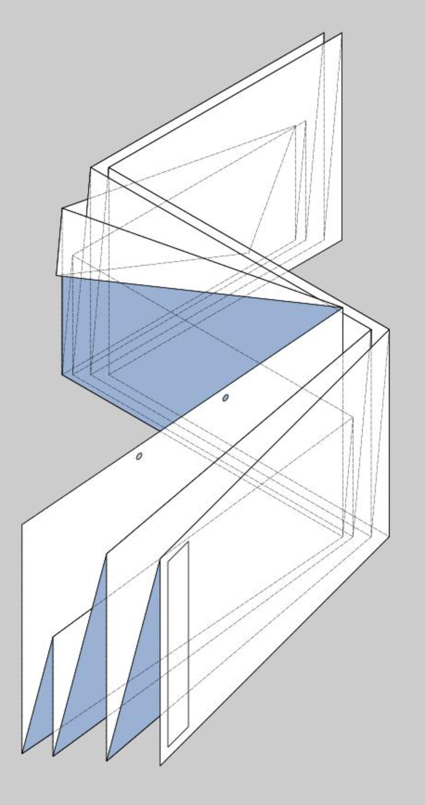
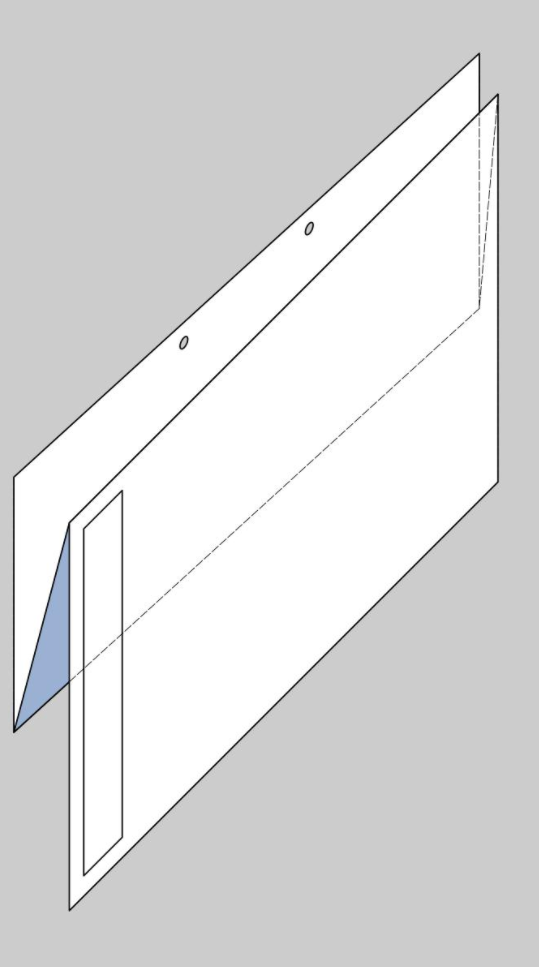

# QGIS Layout Templates
Standard QGIS Layout Templates used by Whanganui District Council

Templates have the following features:

* Sizes A0, A1, A2, A3, A4 (sizes/orientations are designed to be foldable down to A4 Portrait for inclusion into other Documents)

* Numbered Fold lines in the margins (light grey)
* Fold instruction icon in bottom LHS
* Bindable edge on LHS
* Standard title block with:
  * Title
  * Logo
  * Scalebar
  * Auto populated Scale text
  * North point that auto rotates with map
  * Auto populated created by (uses your Windows login name)
  * Auto populated printed date time
  * Version and Sheet numbers that you manually change

## How to fold

### A0 Sheets

### A1 Sheets

### A2 Sheets

### A3 Sheets

